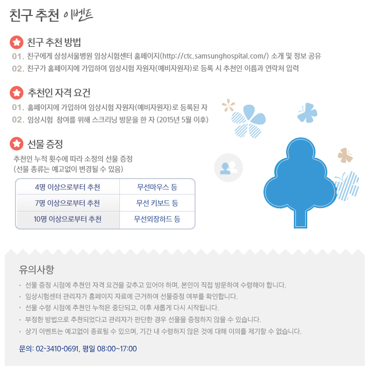
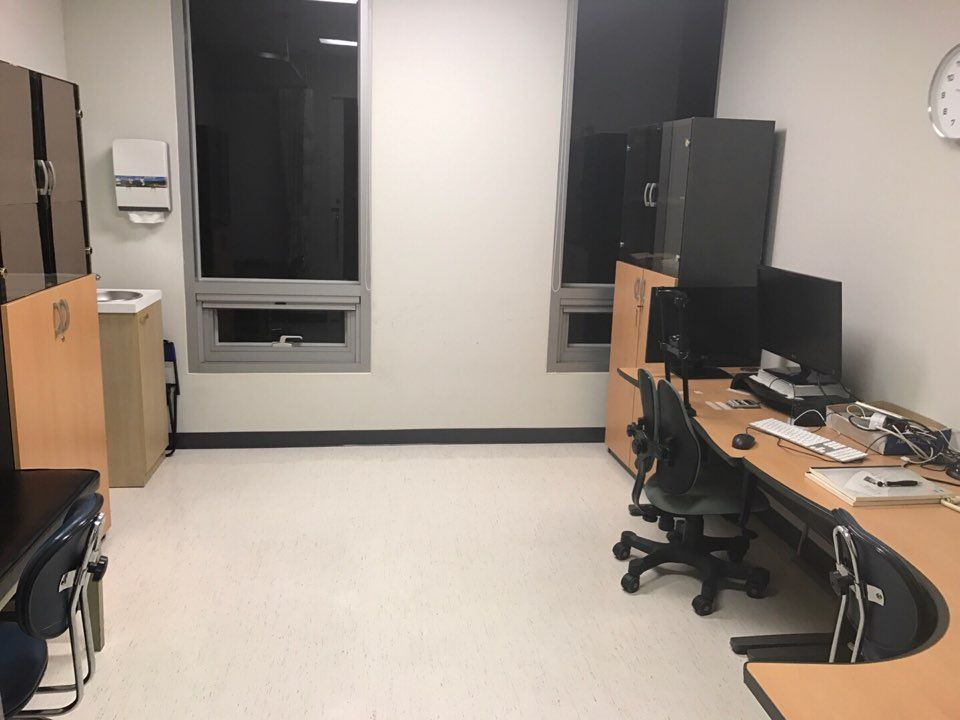

저희 임상약리학과에서는 최근 건강자원자의 모집과 관련하여 큰 어려움을 겪고 있습니다. 

건강자원자를 통한 임상시험은 신약개발 초기 과정에서 가장 중요하고 필수적인 과정이지만, 의학적인 필요성보다는 건강자원자의 **경제적 요구 및 참여 편의성**에 많이 의존하게 됩니다. 환자들은 치료적 임상시험에 참여함으로서 검사비, 치료비의 감면 그리고 질병의 치료라는 이득을 얻을 수 있지만, 건강자원자들은 경제적 보상을 제외하면 순수한 의학 발전을 위한 기여라는 다소 추상적인 가치 외에 얻을 수 있는 것이 현실적으로 없기 때문입니다.

따라서 건강대상자의 임상시험 참여는 1. 과연 경제적 보상이 얼마나 이루어 지는가? 2. 참여하는 것이 얼마나 편리한가?라는 의문이 투명하고 적절하게 해결될 때, 그 참여율이 높아질 수 있겠습니다. 

최근의 상황은 여러 언론에서 자원자 임상시험의 부정적인 면을 부곽함에 따라, 임상시험에 대한 긍정적 인식이 저하되었고 이에 따라 전국의 임상시험 실시기관/병원에서는 건강자원자 모집의 큰 어려움을 겪고 있습니다. 특히 우리 병원의 자원자 모집 시스템은 수도권의 다른 병원의 그것에 비해 시대의 흐름을 반영하지 못한 부분이 많아서 개선의 여지가 크다고 할 수 있습니다. 이 결과, 다른 병원에 비해 서울아산병원 임상약리학과의 건강자원자 모집은 더 큰 어려움을 겪고 있습니다. 

따라서 다음과 같은 부분에서 이노베이션 센터의 조언을 받아보고 싶습니다.

## 1. 홈페이지 User Interface

먼저 홈페이지 디자인에 대한 부분입니다. 우리병원의 [임상시험센터의 자원자 모집](http://ctc.amc.seoul.kr/ctc/support/partnerList.do)에 대한 화면입니다. (Figure 1A)

다음과 같은 것을 발견할 수 있습니다.

- [서울대학교 임상시험센터의 자원자 모집](http://snuhclinicaltrials.com/kr/study/study_list.asp?stp=H) (Figure 1B) 에 비해 User Interface가 크게 뒤쳐짐을 알 수 있습니다. 
- 참여비가 한번에 볼 수 있는 반면 (Figure 1B) 우리 병원의 홈페이지에서는 자원자가 얼마나 적절히 보상되는지에 대한 내용이 전혀 공개가 안되어 되어있습니다.  클릭하고 상세 정보를 확인하려 해도 마찬가지입니다.
- Mobile-friendly 하지 않고 HTML5 표준을 따르고 있지 않기 때문에 휴대폰으로 접속할 때 효과적인 정보 전달이 어렵습니다. (Figure 2)
- 참여를 하기 위해서는 1. Email을 보내거나, 2. CTMS에 회원가입 후 로그인을 해야 하는데, 이 과정이 또 하나의 장애물이 되고 있습니다. 서울대학교 임상시험센터에서는 회원가입없이 HTML form을 사용하여 간편하게 지원할 수 있습니다.

## 2. 지인 소개에 대한 제한

두번째로 지인 소개에 대한 내용입니다. 

- 타 기관에는 SNS 공유하기 버튼이 있어 (Figure 1B) 임상시험 참여를 지인에게 알릴 수 있지만, 우리병원에는 이런 기능이 없어서 공유가 힘들게 되어 있습니다.
- 삼성서울병원 임상시험센터에는 지인소개에 대한 incentive가 공지되어 있음에도 (Figure 3), 우리병원에서는 IRB에서 이를 원칙적으로 금하고 있다고 합니다. 과도한 규제로 인해 자원자 모집에 효과적인 수단이 제한받고 있습니다.

## 3. 대상자를 위한 공간의 부재

세번째로 임상시험 센터 (연구동 1층) 의 대상자 설명 공간에 대한 부분입니다.
 
현재는 임상시험센터 임시 공간에서 대상자 설명회가 진행되었으나, 공간 부족 등의 이유로 공간 사용에 어려움이 있습니다.
건강자원자 임상시험을 하는 타 센터의 경우, 동의 취득 ~ 검사까지 한 공간에서 one-stop 으로 하는 곳이 많아지고 있는 추세입니다.
또한, 스크리닝 검사를 위해 방문하는 건강자원자이 complain을 하기도 합니다.
 

결론을 내리자면

1. 서울아산병원 임상시험센터를 통해 진행되고 있는 '건강자원자의 임상시험 참여를 위한 정보 제공 방식'이 시대의 흐름을 따라가지 못하고 있다고 할 수 있으며
2. 이를 극복하여 참여를 위해 내원을 한 경우에도, 임시적이고 협소한 설명 공간과 이후 검사를 위한 동선 등이 편리하지 않다고 할 수 있습니다.
 
임상시험에서 대상자 보호는 지극히 중요한 가치이며 안전한 임상시험을 위해 우리병원에서는 IRB, HRPP 등의 기관을 통해 관리/감독함으로서 이를 최상의 가치로 삼고 있습니다. 그러나 이런 가치와 무관한 과거의 규제 혹은 지원 미비로 인해 급감하는 건강자원자의 수와 이에 따른 임상시험의 지연, 그리고 분산/분할 투여 이슈로 인한 각종 손실(시간/노동력)이 발생하고 있어 업무의 커다란 지장이 발생하고 있습니다.
 
저희 과에서 몇 차례 회의를 통해 개선점을 찾고자 하였으나 뾰족한 묘안이 나오지 않아 이상의 사항에 대하여 이노베이션 센터의 컨설팅을 요청하오니 숙고 바랍니다.

감사합니다.

한성필
